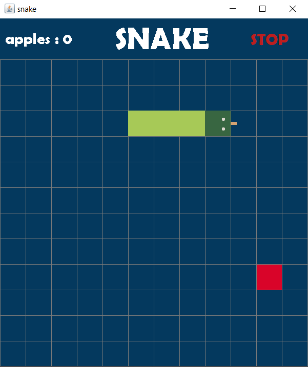
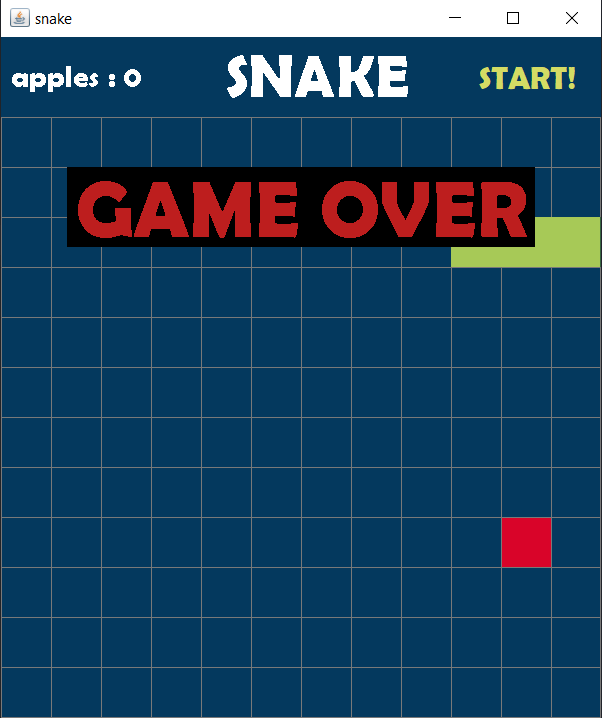
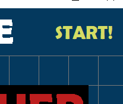

**snake game in java
with sound !!!!**

`now I set gameOver and eating and button sound to the game
so we have soundtrack during our game`

Here we have spatial game snake with details

GAME OVER panel that appear when you lose and playing game over song

and start button that you don't need to execute again

you can easily change theme color because of clean code programing
and most of  the colors declare in classified field section in GamePanel.class

